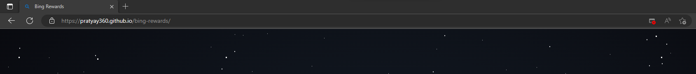
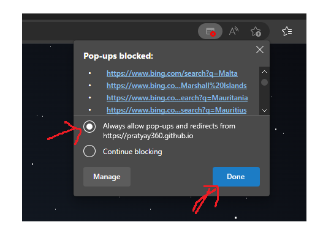
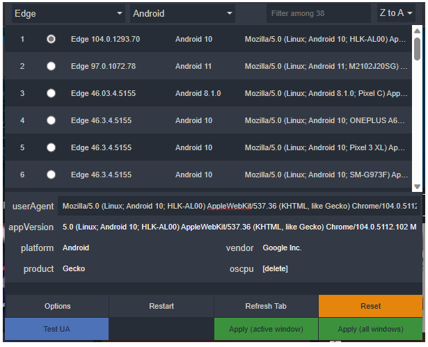

# bing-rewards

## Note: Your browser can block pop-ups

Here's how to allow pop-ups after running for the first time:

## Additionally: You can install an User-Agent Switcher Add-on and set it to Edge Android in order to collect additional points

  

Here's how it looks like:

Change the browser to Edge and the OS to Android, then click "Apply (all windows)", like below:

